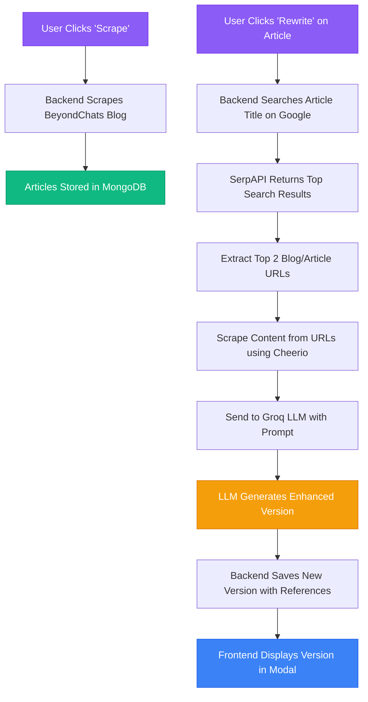

# BeyondChats Blog Enhancement System

> AI-powered content optimization platform that scrapes articles, analyzes top-ranking content, and generates enhanced versions using LLM technology.

## 🌐 Live Demo

- **Frontend**: [beyondchats.iamabhinav.dev](https://beyondchats.iamabhinav.dev) (Hosted on Cloudflare)
- **Backend API**: [api.beyondchats.iamabhinav.dev](https://api.beyondchats.iamabhinav.dev) (Hosted on DigitalOcean)

## 🚀 Features

- **Web Scraping**: Automatically scrape articles from BeyondChats blog
- **AI Enhancement**: Generate optimized content using Groq's 
- **Version Control**: Track multiple AI-enhanced versions of each article
- **Modern UI**: Beautiful, responsive React frontend with dark theme
- **RESTful API**: Complete CRUD operations for articles
- **Markdown Support**: Full markdown rendering 

## 🏗️ Architecture

```
┌─────────────┐
│   Browser   │
└──────┬──────┘
       │
       ▼
┌─────────────────────────────────────────┐
│          React Frontend                  │
│  ┌─────────────────────────────────┐   │
│  │  • Article List (Original)      │   │
│  │  • AI-Enhanced Articles         │   │
│  │  • Version History Modal        │   │
│  │  • Markdown Viewer              │   │
│  └─────────────────────────────────┘   │
└──────────────┬──────────────────────────┘
               │ HTTP/REST API
               ▼
┌─────────────────────────────────────────┐
│       Express.js Backend                 │
│  ┌─────────────────────────────────┐   │
│  │  Controllers & Routes           │   │
│  │  • Blog CRUD                    │   │
│  │  • Scraping Service             │   │
│  │  • AI Rewrite Service           │   │
│  └─────────────────────────────────┘   │
└─────┬───────────────────────────────────┘
      │
      ├─────────┬─────────┬─────────┐
      ▼         ▼         ▼         ▼
   MongoDB   SerpAPI   Groq AI   Cheerio
   (Storage) (Search)  (LLM)   (Scraping)
```

## 📊 Data Flow



## 🛠️ Tech Stack

### Backend
- **Runtime**: Node.js 18+
- **Framework**: Express.js
- **Database**: MongoDB with Mongoose
- **Scraping**: Cheerio, Axios
- **Search**: SerpAPI (Google Search)
- **AI**: Groq API (gpt/oss-120b)
- **Logging**: Morgan, Winston

### Frontend
- **Framework**: React 18
- **Build Tool**: Vite
- **Styling**: TailwindCSS 4
- **Routing**: React Router v6
- **Markdown**: react-markdown + remark-gfm
- **Icons**: Lucide React

## 📋 Prerequisites

- Node.js 18 or higher
- MongoDB (local or Atlas)
- Groq API key ([Get it here](https://console.groq.com/))
- SerpAPI key ([Get it here](https://serpapi.com/))

## 🚀 Local Setup

### 1. Clone Repository

```bash
git clone https://github.com/rishiyaduwanshi/beyondchats.git
cd beyondchats
```

### 2. Backend Setup

```bash
# Install dependencies
pnpm install

# Create environment file
cp .env.eg .env.dev

# Edit .env.dev with your credentials
nano .env.dev
```

**Required Environment Variables:**

```env
# Database
MONGO_URI=mongodb://localhost:27017/beyondchats

# API Keys
GROQ_API_KEY=your_groq_api_key_here
SERPAPI_KEY=your_serpapi_key_here

# Server
PORT=5050
NODE_ENV=development
```

**Start Backend:**

```bash
pnpm dev
```

Backend runs at: `http://localhost:5050`

### 3. Frontend Setup

```bash
cd web

# Install dependencies
pnpm install

# Start development server
pnpm dev
```

Frontend runs at: `http://localhost:5173`

## 📡 API Endpoints

### Base URL: `/api/v1`

#### Blogs (Original Articles)

| Method | Endpoint | Description |
|--------|----------|-------------|
| GET | `/blogs/scrape?limit=5` | Scrape articles from BeyondChats |
| GET | `/blogs` | Get all articles |
| GET | `/blogs/:id` | Get single article |
| GET | `/blogs/:id/versions` | Get all AI versions |
| POST | `/blogs/:id/rewrite` | Generate AI version |
| POST | `/blogs/:id` | Update article |
| DELETE | `/blogs/:id` | Delete article |

#### LLM Blogs (AI-Enhanced)

| Method | Endpoint | Description |
|--------|----------|-------------|
| GET | `/llmblogs` | Get all enhanced articles |
| GET | `/llmblogs/:id` | Get single enhanced article |
| POST | `/llmblogs/:id` | Update enhanced article |
| DELETE | `/llmblogs/:id` | Delete enhanced article |

### API Documentation

Visit `http://localhost:5050/` or `http://localhost:5050/api/v1` for complete API documentation.

## 🎯 Usage Guide

### 1. Scrape Articles

```bash
# By default it will scrape 5 blog articles
# Via API
curl "http://localhost:5050/api/v1/blogs/scrape?limit=5"

# Via Frontend
Click "Scrape Articles" button → Select count → Confirm
```

### 2. View Articles

Navigate to homepage - all scraped articles will be displayed in cards.

### 3. Generate AI Version

Click the green sparkle icon (✨) on any article → Confirm → Wait for a while in  future version i will implement SSE.

### 4. View Versions

Click the purple branch icon (🌿) to see all AI-enhanced versions in a modal.

### 5. Read Full Article

Click "Read Full Article" on any AI-enhanced version to view markdown content.


## 🐛 Troubleshooting

### MongoDB Connection Issues

```bash
# Check if MongoDB is running
mongosh

# Start MongoDB service (Windows)
net start MongoDB

# Start MongoDB service (Linux/Mac)
sudo systemctl start mongod
```

### API Key Errors

Ensure `.env.dev` has valid API keys:
- Get Groq API key: https://console.groq.com/keys
- Get SerpAPI key: https://serpapi.com/manage-api-key

### 403 Errors During Scraping

Some websites block scrapers. 

## 📚 References & Credits

### Documentation Used
- [Groq API Documentation](https://console.groq.com/docs)
- [Cheerio Documentation](https://cheerio.js.org/)
- [SerpAPI Documentation](https://serpapi.com/search-api)
- [React Markdown](https://github.com/remarkjs/react-markdown)
- [TailwindCSS v4](https://tailwindcss.com/docs)

### Boilerplate
This project uses [Express Boilerplate](https://github.com/rishiyaduwanshi/boiler) as foundation - a ready-to-go Express.js starter with logging, error handling, and authentication setup.

## 👨‍💻 Author

**Abhinav Prakash**

- Portfolio: [iamabhinav.dev](https://iamabhinav.dev)
- GitHub: [@rishiyaduwanshi](https://github.com/rishiyaduwanshi)
- Email: hello@iamabhinav.dev

source community for the awesome tools

---

**Note**: This is a demonstration project showcasing full-stack development, AI integration, and modern web technologies. The scraping functionality respects robots.txt and rate limits.
